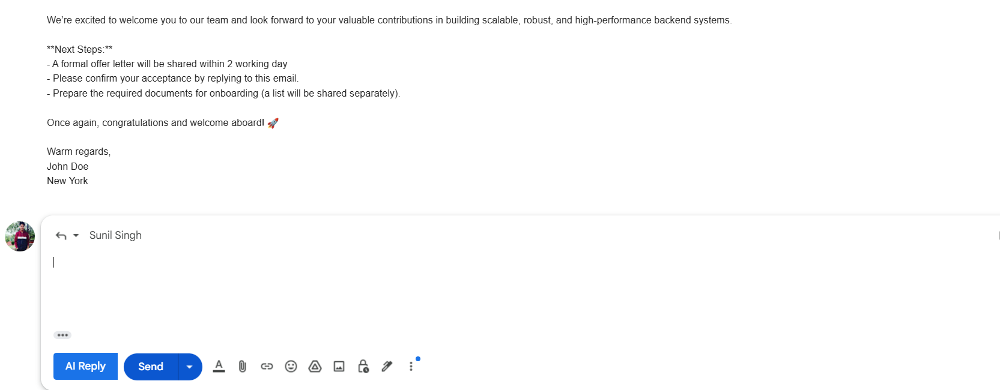
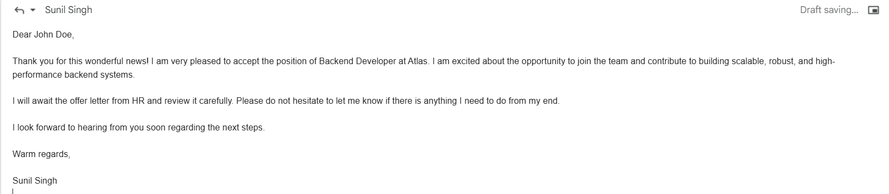

# ✉️ AI Email Writer Assistant

An AI-powered tool that helps you automatically generate professional, smart email replies directly inside Gmail and Outlook.  
Powered by Java Spring Boot, React (optional), and a Chrome Extension. Deployed with Docker on Azure.

---

## 🚀 Features

✅ Generate context-aware replies to emails with one click  
✅ Choose tone: Professional, Casual, Friendly  
✅ Chrome Extension integrates into Gmail & Outlook, adds "AI Reply" button to your compose box  
✅ Spring Boot backend using Gemini (or other generative language models)  
✅ Deployed on Azure App Service via Docker, image hosted on Docker Hub

---

## 🖥️ Tech Stack

| Layer              | Technology                          |
|--------------------|------------------------------------|
| **Backend API**     | Java 21, Spring Boot 3, WebClient  |
| **Frontend UI**     | React + MUI (optional)             |
| **Browser Extension** | JavaScript (Manifest V3)         |
| **Containerization** | Docker, Docker Hub               |
| **Cloud**           | Azure App Service (Linux Container) |

---

## 🚀 Getting Started

### 🐳 Run backend locally via Docker

```bash
docker pull dasiladev/email-writer-app:latest
docker run -p 8080:8080 dasiladev/email-writer-app:latest
```
### The API will be available at:

```bash 
http://localhost:8080/api/email/generate

```
## ⚙️ Environment variables
```angular2html
GEMINI_API_URL=https://generativelanguage.googleapis.com/v1beta/models/gemini-pro:generateContent
GEMINI_API_KEY=YOUR_API_KEY

```
---
# 🌐 Chrome Extension

### The Chrome Extension injects an "AI Reply" button directly into Gmail & Outlook.
When clicked, it:

- Reads the email thread content

- Sends it to your backend

- Inserts the generated reply into the compose box

## 🔧 Set your backend URL
### Inside your extension project, edit:
```angular2html
// config.js or content.js
const BACKEND_URL = "https://Localhost:8080/api/email/generate";

```
## 🚀 Load extension in Chrome
1. Go to chrome://extensions

2. Enable Developer mode

3. Click Load unpacked

4. Select your email-writer-ext directory

That’s it! Now open Gmail or Outlook and try replying to an email — you’ll see the "AI Reply" button.
---
# 🐳 Build and push your own Docker image
### If you want to build and host under your Docker Hub:
```bash
docker build -t yourdockerhub/email-writer-app:latest .
docker push yourdockerhub/email-writer-app:latest
```

## ☁️ Deploy on Azure
### This project runs seamlessly on Azure App Service (Linux Container):

- Create a Web App with Docker

- Set the Docker Hub image name

- Add GEMINI_API_URL and GEMINI_API_KEY in Configuration
- Your app will be available at:
- ```bash 
  https://your-app-name.azurewebsites.net/api/email/generate```
  
---
# 📸 Screenshots


### click on the "AI Reply" button to generate a reply


---
## License

This project is licensed under the [MIT License](LICENSE).


## ⭐ Star this repo!
If you found this helpful, please ⭐ star the repo to support future development!

